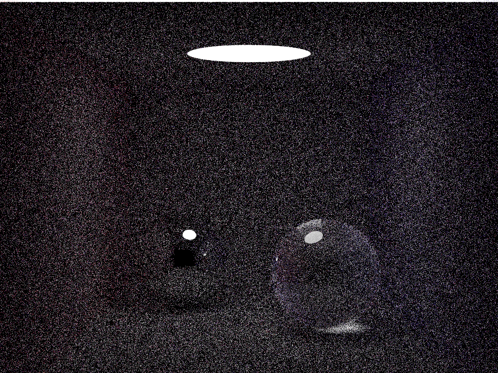

# A Custom Container On Function Compute

This code deploys a custom Docker container image to Function Compute. 

The custom image includes both an HTTP server written using Flask + Python 3, and a copy of Kevin Beason's [smallpt raytracer](https://www.kevinbeason.com/smallpt/) written in C++. 

The `smallpt.cpp` code is borrowed directly from Kevin Beason's website and falls under the MIT license he attached to the code (see link above).

My own code and configuration files (everything else) is also under an MIT license. Some of the code was inspired by the Function Compute examples located in the [start-fc](https://github.com/devsapp/start-fc) GitHub repository.

# Building the Code

First, `cd` into the `code` directory (inside `fc-raytrace`), and run:

```
docker build -t custom-fc .
```

This will create a Docker container image you can use for local testing. Assuming you have bound port 9000 on the container to port 9000 on `localhost`, you should be able to invoke the function from your web browser 
with:

```
http://localhost:9000?spp=4
```

This will invoke the `smallpt` raytracer inside the container with a "quality" setting of 4 samples-per-pixel (spp). Within about 20 seconds of your request, your browser should download the resulting image file, `image.ppm`. 

The image should look something like this:



Not very good, but you can *almost* make out a scene. Increasing the `spp` value to 8, 16, or even 32 when invoking the function will result in a *much* better looking render, but will increase the render time significantly.

# Pushing to Alibaba Cloud Container Registry

**Important note:** If you are on an arm64 ("M1") Mac or other non-x86_64 hardware, you need to rebuild your container image **before** pushing it to Alibaba Cloud Container Registry. Specifically, you need to do something like this from within the `code` directory:

```
docker buildx --platform linux/amd64 -t custom-fc-x86 .
```

You then push *this* image to Alibaba Cloud Container Registry, instead of the one you built for local testing. 

Once you have your nice new image ready, it's time to push it to ACR (Alibaba Cloud Container Registry). To do this, you need to:

1. Log in to your registry using `docker`
2. *Tag* your image
3. *Push* your image

These three steps are actually explained in detail **inside the ACR console**. If you click on your repository, then click on "Details", you'll see three example commands (somewhat) like these ones:

**Step 1: Log in**
```
docker login --username=jeremydavispede****@outlook.com registry-intl.ap-southeast-1.aliyuncs.com
```

**Step 2: Tag**
```
docker tag [ImageId] registry-intl.ap-southeast-1.aliyuncs.com/raytracer-test-ns/raytracer-test-repo:[tag]
```

**Step 3: Push**

```
docker push registry-intl.ap-southeast-1.aliyuncs.com/raytracer-test-ns/raytracer-test-repo:[tag]
```

Obviously you need to replace `[ImageID]` with name of your Docker image. If you have been following along with this README, that will be either `custom-fc` or `custom-fc-x86` (see above).

You should also replace `[tag]` at the end of the `push` and `tag` commands with the name you'd like your image to have once it is uploaded to ACR. I usually use *version numbers*, like `v1` or `v2`. This way, I can track chnages to my image over time.

# Deploying the Code

Take a look at the contents of the `s.yaml` file (in the `fc-raytrace` directory): you will need to change the `image` field towards the bottom of the file. It looks like this:

```yaml
customContainerConfig:
    image: registry-intl.ap-southeast-1.aliyuncs.com/raytracer-test-ns/raytracer-test-repo:v1 # Replace this with the path to YOUR container registry + image 
```

Change the image information after `image:` so that it matches the value you used in the `tag` and `push` commands above. 

You can then run:

```
s deploy
```

To deploy your function (again, from inside the `fc-raytrace` directory).

If `s deploy` succeeds, Function Compute will return an *endpoint URL* which you can use to call your function. In my case, the output from `s deploy` looks something like this:

```yaml
raytrace-service: 
  region:   ap-southeast-1
  service: 
    name: raytrace-service
  function: 
    name:       raytrace-function
    runtime:    custom-container
    handler:    not-used
    memorySize: 512
    timeout:    900
  url: 
    system_url: https://5483593200991628.ap-southeast-1.fc.aliyuncs.com/2016-08-15/proxy/raytrace-service/raytrace-function/
  triggers: 
    - 
      type: http
      name: httpTrigger

```

That `system_url:` field is the *endpoint URL* of your brand new function! 

If you append `spp=4` or `spp=8` to the end of that URL, it will call the function, run the `smallpt` raytracer, and return an image file!

Try it out with a few different values for `spp`! 

**Important note:** Unless you bind a [custom domain name](https://www.alibabacloud.com/help/doc-detail/90763.htm) to Function Compute, the image file won't be called `image.ppm`. Instead, your browser will download a file simply called `download` with no extension. Rename this to `image.ppm` and you should then be able to open it just fine.

This is a quirk of function compute: unless a custom domain name is bound, it forces **all** HTTP responses from *any* function to be directly downloaded, and it does not allow you to set a name (so the browser chooses the default name - `download` - for the file instead). Binding a custom domain name fixes this, but it's an extra step and requires you to have a domain name available, so I skipped it. 

# Cleaning Up

You can remove triggers, functions, and services using the `s` command, like this:

```
s remove service
s remove function
s remove trigger
```

That said, it's often easiest to clean up directly from the web console. If you delete things from the web console, remember that they need to be removed in this order:

1. Triggers first
2. Then functions
3. Then services