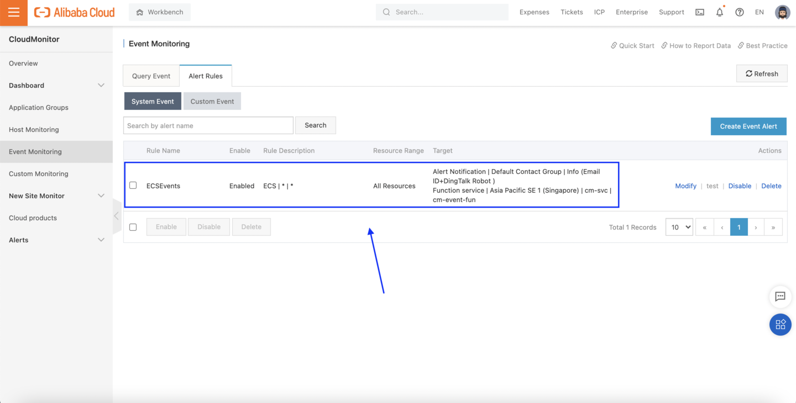

# Slack Integration - Connect CloudMonitor to Slack chat

- Status: **OK**
- Notes: Code tested and working as of 2021-07-02 (YYYY-MM-DD)

## What

The code here helps you connect your CloudMonitor alarms to Slack. It's a simple example, and doesn't do anything with the data from CloudMonitor except convert it to pretty-printed JSON to make it more readable when it's displayed in Slack. Feel free to expand upon it!  

## How

To use this code, you will (of course) need to have Slack set up! If you've never used Slack before but want to follow along anyway, you will first need to:

1. [Get Slack](https://slack.com/get-started#/createnew).
2. Set up a *workspace* (you'll do this during account setup).
3. [Set up at least one new *channel* in your workspace](https://slack.com/intl/en-cn/help/articles/201402297-Create-a-channel). I recommend you not use the *#general* channel that all workspaces have by default. Instead, create a new, separate channel.
4. Create a Slack App. You can follow along with [Slack's "hello world" example](https://api.slack.com/tutorials/hello-world-bolt) to get an idea how this works.
5. [Enable incoming webhooks for your new App](https://api.slack.com/messaging/webhooks).

Once that's done, copy the new webhook URL and paste it into the `index.py` files in `cm-event-fun` and `cm-metric-fun`

Both of those files have a section of code that looks like this:

```python
    # URL of the Slack webhook
    end_url = 'your_slack_url_here'
    headers = {'Content-type': 'application/json'}
```

You want to change `end_url` to match your Slack Webhook

Done? Good! Now we can deploy our FC function. 

## Setting up Function Compute

### Installing the fun CLI

Before we get started, you need to install Docker (optional) as well as the Alibaba Cloud function compute command line tool, `fun` (required). 

- Information on installing Docker is [here](https://docs.docker.com/get-docker/)
- Installation instructions for `fun` are [here](https://www.alibabacloud.com/help/doc-detail/161136.htm)

Note that the `fun` command line tool is **distributed using NPM (node package manager)** so you'll need to have NPM installed in order to install fun. If you are on macOS, you might want to consider installing NPM through [Homebrew](https://brew.sh/), a package manager for macOS. 

After you install `fun` you need to run `fun configure` and enter your Account ID, Access Key, Access Key Secret, and the default Alibaba Cloud region (this is where `fun` will deploy functions when you run `fun deploy`). Details on configuring `fun` can be found on [this page](https://www.alibabacloud.com/help/doc-detail/146702.htm). 

If you have never set up RAM users or Access Key credentials before, take a look at these two documents:

1. [Creating a RAM user](https://www.alibabacloud.com/help/doc-detail/93720.htm)
2. [Creating an Access Key and Secret](https://www.alibabacloud.com/help/doc-detail/53045.htm)

### Deploying To Function Compute

From the `fc-function` directory, you'll need to run `fun deploy` to deploy your code onto Alibaba Cloud. `fun deploy` will look at the contents of `template.yml` to determine how your function (and the service containing it) should be named, as well as any triggers that should be configured (in this case, an HTTP trigger). 

Once that's done, we can test things out by setting up some CloudMonitor Alarm Rules. 

We'll create on Event-based Rule that triggers the `cm-event-fun` function whenever an ECS event (such as creating or deleting an instance) takes place.

We'll also create a "Host monitoring" Rule that calls the `cm-metric-fun` function (via HTTP callback) whenever ECS CPU usage goes above 80% for 1 minute (on any instance).

## Testing things out

To make sure things are working, we'll need to create some CloudMonitor Event-based and Metric-based rules, then trigger them. 

### Creating CloudMonitor Rules

#### Set up an Event-based Alarm Rule

First, let's go to *Event Monitoring*, open the *Alert Rules* tab, and click on *Create Event Alert*:


Set up the rule to trigger for any ECS-related event:


Scroll down and configure the rule to trigger our `cm-event-fun` FC function:


If everything worked, we should see an entry like this in the Rules window:



That's it! 

#### Set Up A Metric-based Alarm Rule

From the left-hand menu in the CloudMonitor console, click on *Host Monitoring*, and then *Alert Rules*. FInally, click on *Create Alert Rule*:


Next, configure the alarm to trigger whenever any ECS instance's CPU usage goes above 80% for more than one minute, then scroll down and paste the HTTP URL for our `cm-metric-fun` function into the *URL callback* textbox:


**Important note: Remember to change the *https://* at the beginning of the Function Compute URL to *http://* intsead, as CloudMonitor doesn't currently support HTTPS**.

After clicking *Confirm*, we should see our new Rule in the Alert Rules tab:


### Triggering CloudMonitor Rules

We can test the event-based alarms by creating a new ECS instance (this will trigger our Event-based Alarm), then using the `stress` command to raise the instance's CPU usage to 100% for 2 minutes (this will trigger our Metric-based Alarm).

If it works, we should see notifications like these showing up in our Slack chat:


To test the "HighCPU" metric-based alarm, we need to give our ECS instance some busywork to do. If you created a Linux instance, you can use the `stress` command to generate a high CPU load. On Ubuntu 18.x and up, you can install it with:

```
apt update
apt install -y stress
```

Then run it like this:

```
stress --cpu 8 --timeout 120s
```

This will launch 8 processes that will do busywork for 2 minutes (120 seconds). That should be long enough to trigger our rule and send a message like this one to Slack:


**That's it! See where you can take things from here. Maybe add customized functions to process particular types of events or trigger custom-formatted Slack messages?** The possibilities are endless.

